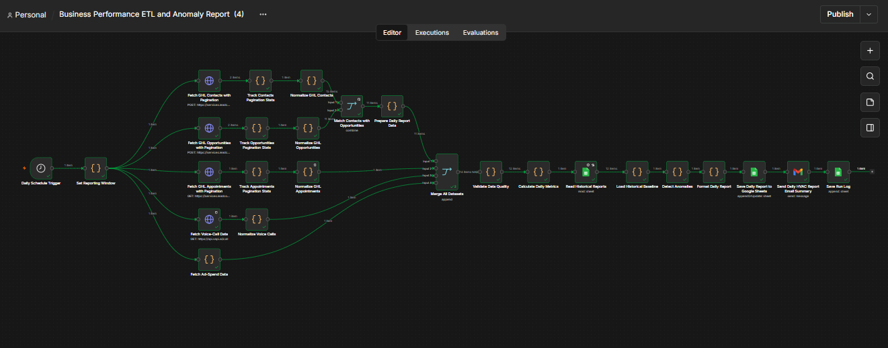
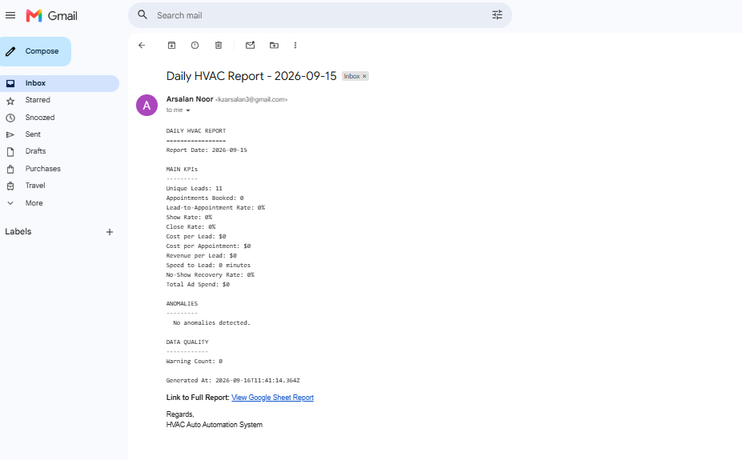

# 📈 Business Performance ETL & Anomaly Reporting Engine — n8n Workflow

An enterprise-grade automated ETL, metric aggregation, and anomaly detection engine built with **n8n**. This pipeline ingests multi-source performance data (GoHighLevel, Google Ads, Call Trackers), normalizes heterogeneous records, calculates daily business KPIs with zero-division protection, compares performance against a 7-day rolling historical baseline, and automates multi-channel dispatch to Google Sheets and Gmail.

---

## 🎬 Live Demo & Walkthrough

> 🚀 **[▶️ Watch Full Workflow Execution Demo](https://www.linkedin.com/posts/arsalan-noor-1510492bb_n8n-automation-artificialintelligence-activity-7505002228081078272-2OHW)**  
> **Platform:** LinkedIn / Loom Video Walkthrough  
> **What You'll See:** Real-time GHL API pagination ➔ Multi-source dataset merging ➔ Safe zero-division KPI calculations ➔ 7-Day baseline anomaly engine ➔ Google Sheets persistence & Gmail summary dispatch.

---

## ⚙️ What It Does

> 💡 **Workflow Overview**
> 
> * **1. Scheduled Ingestion:** Daily PST trigger initiates multi-source API data fetch with rate-limit safeguards.
> * **2. Pagination & Normalization:** Iterates through paginated contacts/leads, standardizing disparate JSON fields into a unified schema.
> * **3. Data Quality Screening:** Validates raw items for missing IDs, invalid timestamps, negative revenue, and duplicate appointments.
> * **4. Safe KPI Computation:** Executes custom `safeDivide()` math operations to compute core business conversion metrics without runtime crashes.
> * **5. Baseline Comparison & Anomaly Engine:** Fetches historical Google Sheets logs, constructs a 7-day rolling baseline, and evaluates threshold-based alerts.
> * **6. Multi-Channel Reporting:** Stores clean summary logs in Google Sheets, dispatches HTML summary emails via Gmail, and writes execution logs to `RunLog`.

---

## 🖼️ System Screenshots

| Workflow Architecture | Data Quality & KPI Engine |
| :---: | :---: |
|  |  |

| Master Daily KPI Ledger & Anomaly Log |
| :---: |
| ![Google Sheets KPI Database]
(Screenshot 2026-09-16 165444.png
Screenshot 2026-09-16 165546.png
) |

---

## ⚡ Features & System Capabilities

| Feature | Description |
| :--- | :--- |
| ⏰ **Timezone-Isolated Boundary** | Automatically calculates PST daily boundaries to prevent record overlap across timezone offsets. |
| 🔄 **Cursor-Based Pagination** | Safely traverses multi-page API responses with max page safety caps and 500ms rate-limit delays. |
| 🛡️ **Data Quality Safeguard** | Automatic detection and tracking of missing contact IDs, bad dates, and duplicate appointment records. |
| 🧮 **Zero-Division Math Helper** | Custom JS helper function handles empty lead/appointment days cleanly without throwing `NaN` or crashing. |
| 📊 **7-Day Rolling Baseline** | Pulls historical report rows from Google Sheets to dynamically calculate rolling performance averages. |
| 🚨 **Threshold Anomaly Alerts** | Evaluates real-time performance against baseline drops (Lead drop, CPL spikes, show rate crashes). |
| 📝 **Execution Audit Telemetry** | Stores detailed run logs (`run_id`, page counts, warning counts, completed timestamps) for full visibility. |

---

## 📋 Calculated Business KPIs & Logic

| Metric | Business Definition / Logic | Example Output |
| :--- | :--- | :--- |
| 🎯 **Lead-to-Appointment Rate** | `Booked Appointments / Unique Leads` | `18.5%` |
| 🤝 **Show Rate** | `Showed Appointments / Scheduled Appointments` | `75.0%` |
| 🏆 **Close Rate** | `Won Opportunities / Qualified Opportunities` | `33.3%` |
| 💵 **Cost per Lead (CPL)** | `Total Ad Spend / Unique Leads` | `$42.50` |
| 📅 **Cost per Appointment (CPA)** | `Total Ad Spend / Booked Appointments` | `$229.72` |
| 💰 **Revenue per Lead** | `Won Revenue / Unique Leads` | `$310.00` |
| ⚡ **Speed to Lead** | `First Outbound Time - Lead Created Time` | `4.2 Minutes` |
| 🔄 **No-Show Recovery Rate** | `Rebooked No-Shows / Total No-Shows` | `25.0%` |

---

## 🚨 Anomaly Detection Rules

| Risk Metric | Operational Threshold | System Action |
| :--- | :--- | :--- |
| 📉 **Lead Volume Drop** | >35% decrease vs. 7-Day Rolling Average | Trigger Anomaly Flag & Highlight in Email |
| 📈 **CPL Spike** | >30% increase in Cost per Lead | Trigger Anomaly Flag & Highlight in Email |
| 📉 **Show Rate Drop** | Drops by >15 percentage points | Trigger Anomaly Flag & Highlight in Email |
| ⏳ **Speed to Lead Alert** | Response time exceeds 10.0 minutes | Trigger Anomaly Flag & Highlight in Email |
| ⚠️ **Data Quality Warning** | `data_quality_warning_count > 5` | Flag Data Integrity Alert |

---

## 🔄 Workflow Execution Pipeline

| Step | Phase | Action / Node Executed | Description |
| :---: | :--- | :--- | :--- |
| **01** | **Trigger** | `Schedule Trigger` | Fires daily at 8:00 AM PST to start the reporting sequence. |
| **02** | **Ingestion** | `Fetch GHL Contacts / Apps` | Loops through paginated API endpoints using cursor tokens and rate delays. |
| **03** | **Normalizing** | `Merge & Clean Nodes` | Combines 4 input streams and standardizes JSON structure across all record types. |
| **04** | **Validation** | `Validate Data Quality` | Evaluates missing fields, bad dates, and increments global warning counters. |
| **05** | **Calculation** | `Calculate Daily Metrics` | Executes zero-safe KPI math formulas and rounds values for clean reporting. |
| **06** | **Baseline** | `Read Historical Reports` | Ingests 7-day historical logs from Google Sheets and builds performance averages. |
| **07** | **Detection** | `Detect Anomalies` | Compares current day KPIs against 7-day averages using rule thresholds. |
| **08** | **Output** | `Sheets, Gmail & RunLog` | Appends metrics to Sheet1, dispatches HTML Gmail summary, and logs metadata. |

---

## 🛠️ Tech Stack & Integration Ecosystem

| Tool / Technology | Role in Workflow |
| :--- | :--- |
| ⚡ **n8n** | Enterprise workflow orchestration, looping logic, and error handling |
| 🎯 **GoHighLevel (GHL) API** | Source system for Contacts, Opportunities, and Appointment records |
| 📊 **Google Sheets API** | Historical database persistence and daily KPI tracking sheet |
| 📧 **Gmail API** | Formatted daily summary email delivery with anomaly highlighting |
| 📜 **JavaScript (ES6+)** | Custom data quality validators, `safeDivide()` math engine, and baseline logic |

---

## 💡 Practical Use Cases

| Business Scenario | Problem Solved | Operational Impact |
| :--- | :--- | :--- |
| **Executive Performance Reporting** | Manual daily spreadsheet updating and delayed KPI calculations | 100% automated daily reporting delivered every morning at 8 AM PST |
| **Ad Spend Efficiency Monitoring** | Unnoticed ad spend burn due to sudden Cost Per Lead spikes | Immediate anomaly alerts delivered via email before budget is wasted |
| **Sales Team Responsiveness** | Slow response time to new incoming leads | Real-time tracking of Speed-to-Lead with alerts if response time > 10 min |

---

## 🚀 Setup & Execution Guide

| Step | Task | Details |
| :---: | :--- | :--- |
| **01** | **Import Workflow** | Open n8n ➔ Click **Import from file** ➔ Select `workflows/expense-management-workflow.json`. |
| **02** | **Set OAuth / API Keys** | Connect **GoHighLevel API Bearer Token**, **Google Sheets**, and **Gmail** credentials. |
| **03** | **Setup Google Sheet** | Create target sheet with two tabs: `Sheet1` (KPI summary) and `RunLog` (Audit trail). |
| **04** | **Activate Engine** | Toggle workflow status to **Active** to begin automated daily runs. |

---

## 📜 License

MIT License — Free to use, modify, and deploy for personal or commercial projects.
